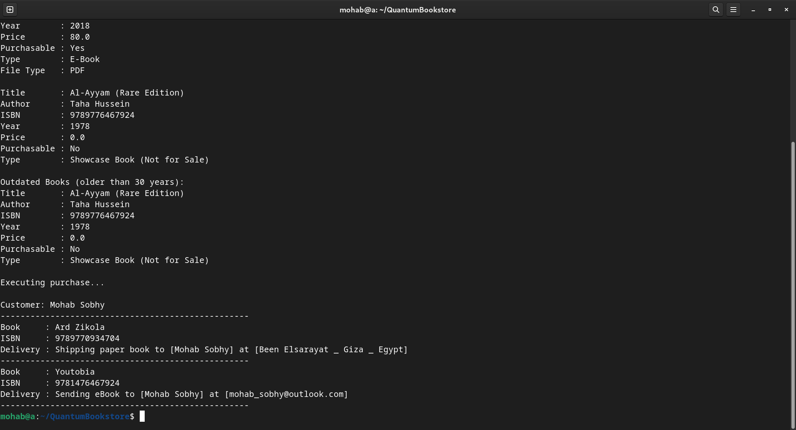

````markdown
# QuantumBookstore

QuantumBookstore is an object-oriented Java application that simulates a bookstore system. It manages different types of books (e.g., paper books, eBooks, showcase books), supports book ordering and purchasing, and integrates flexible delivery strategies.

---

## 📊 Class Diagram

The UML class diagram below provides a high-level overview of the core classes and their relationships:


---

## 📸 Application Screenshot

Below is a sample screenshot demonstrating the output or behavior of the application:



---

## 📁 Project Structure

```bash
.
├── ScreenShot
│   └── screenshot.png         # Sample screenshot of application behavior or execution
├── UMLDiagram
│   └── ClassDiagram.jpg       # UML class diagram representing system design
├── src
│   ├── controller             # Entry point of the application
│   │   └── QuantumBookstoreFullTest.java
│   ├── delivery               # Delivery strategy interface and its implementations
│   │   ├── DeliveryStrategy.java
│   │   ├── EmailDelivery.java
│   │   └── ShippingDelivery.java
│   ├── model                  # Core domain models: Book, Order, Customer, etc.
│   │   ├── Book.java
│   │   ├── BookOrder.java
│   │   ├── Customer.java
│   │   ├── EBook.java
│   │   ├── Inventory.java
│   │   ├── Order.java
│   │   ├── PaperBook.java
│   │   └── ShowcaseBook.java
│   ├── service                # Business logic and service classes
│   │   ├── InventoryService.java
│   │   └── PurchaseService.java
│   └── util                   # Utility/helper classes
│       └── BookListFormatter.java
```
````
